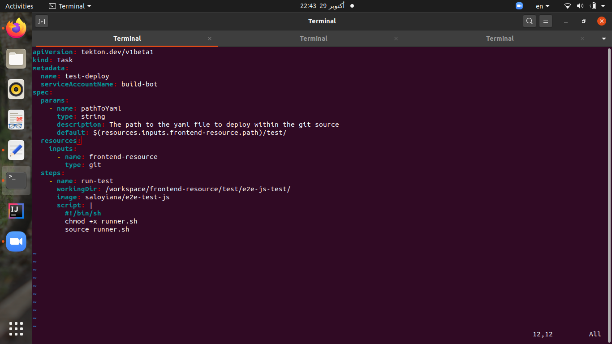

# The Final Project of the DevOps Bootcamp


This project done as one of the requirement to complete the bootcamp. It aims to demonstrate the skills that have been gained in the last four months.


## Project's requirements overview:   
One of the main given instructions is to deploy the entire system (to test, test it, if pass, start deploying to production) using one or two commands in 21 days duration. Also, ELK and Grafana is a must.  

### The platform:
Eight microservices (e.g. frontend, payment, carts, and orders) need to be build based on the microservices architecture.  

### Tools:
Required different tools to be used such as:  
* Docker as containerization tool  
* Kubernetes as an orchestration tool  
* Tekton as CICD tool  
* Elasticsearch and Kibana (ELK) for logging 
* Prometheus and Grafana for monitoring  

### Rules to follow:   
One of the main given instructions is to deploy the entire system (to test, test it, if pass, start deploying to production) using one or two commands in 21 days duration. Also, ELK and Grafana is a must.  


## What we have so far (result): 
Eight tekton pipelines (each microservice has one), each has at least four tasks,  work as follow:  
1. build and push the required image to docker hub, if successfully done, 
2. Deploy microservices using Kubernetes deployment and service that uses the same image that just built to test namespace, if successfully done,
3. Run the test against the test namespace, if it is a pass 
4. deploy the entire platform to prod namespace  

Also, using `make elk`, elastic search and kibana will be ready, and `make install-prometheus install-grafana`, prometheus and grafana will be ready.

## My instruction :innocent::

Now my respected readers to test my code, follow the steps below:

1. clone the repo:   
`git clone https://github.com/saloyiana/finalProject/`  
2. change your dirctory to it   
`cd finalProject/`     
3. run this command to build the cluster , deploy tekton and tekton cli as well , namespaces , configure elf and grafana.   
`make up`   

4. Then you need to add the secret (until the vault be ready), as follows:
  1. `vim secret.yaml`  
  2. Copy the below code:
  ``` apiVersion: v1
kind: Secret
metadata:
  name: basic-user-pass
  annotations:
    tekton.dev/docker-0: https://index.docker.io # Described below
type: kubernetes.io/basic-auth
stringData:
  username: <YOUR_USERNAME>
  password: <YOUR_PASSWORD_OR_GENERATED_TOKEN>
```
  3. `kubectl apply -f secret.yaml -n test`
4. Run this command to run the pipelines and they on the other hand will deploy the microservices to test namespace, run the test, and finally deploy them to prod namespace   
`make build`  

* To see the logs of the pipelines, run 
 `make logs`
* To list the pipelines, run   
`make list`
* To clean after the pipelines, run 
 `make clean`
* To delete the cluster, run 
 `make cluster-down`
* If all the pipelines failed somehow, you may need to delete one of them and rerun it again, makefile will help (e.g. `make frontend-down` and then `make frontend`) 
That is all, Easy? :smirk:

### Examples of the results that may face: 

#### building and pushing the images :woman_juggling::

#### deploying to test :fist_left::


#### passing the test :smiley::



#### Failing at the test :sweat::


### deploying to prod :golf::

Done. 
