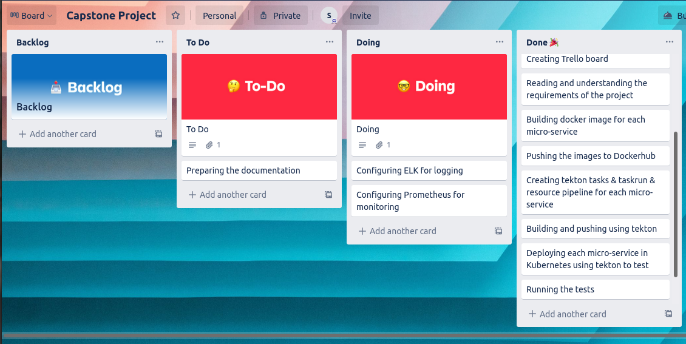
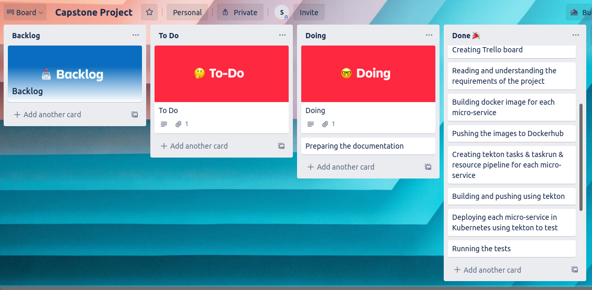

### The working flow:

## Week 1:   

**Dockerfiles building and running.**

- Day1: understanding the requirements of the project, and what I should deliver in the end.
- Day2: Cloning the microservices in one repo and start to build the frontend image using their ready Dockerfile and works without any editing. 
- Day3: Started with the catalogue microservice, the struggle with the Dockerfile starts, after building the image the permission denied issue appeared, skip it for now!
- Day4: Today's image was a cart, and the plugins of the pom file needed to be edited, and then built a new multistage Dockerfile and try to run it.
- Day5: Shipping and payment have been done today ( similar to yesterday's job ) and everything kinda went smoothly after yesterday’s struggle.
- Day6: Today was user and its database day, I have a problem with the permission denied again, the building phase is successfully done though.
- Day7: Today is the day of building and running the queue master image and the order image, I faced a lot of errors, some of them I faced before.    

## Week2:  

**CICD (Tekton) world :**

- Day8: Start doing the tekton tasks ( the first task - build and push ). 
- Day9: Trying to build and push the images using tekton. 
- Day10: Still solving the errors with the building and pushing the images using tekton phase. 
- Day11: Make sure all the pushes and are successful and started preparing the Kubernetes manifests.
- Day12: Completed yesterday's job, and started writing the pipelines.
- Day13: Done the writing of the pipelines' job and started with the deploy to test namespace tasks. 
- Day14: Completed the deploy tasks for each pipeline and the rest of the day off. 

## Week 3:

**Same world**

- Day15: Ran the pipelines that I currently have with two steps and tried to fix the errors, and gave required permissions 
- Day16: Ran the test locally with the IP, and got stuck with the errors. 
- Day17: Still Trying to survive 
- Day18: Started to create tasks for running the test and included them in the pipelines as a new step, didn't try to run them yet. 
- Day19:  Started with trying to run the test and failed and failed and failed and failed and failed and failed and failed and failed and failed and failed and failed and failed and failed and failed and failed and failed and failed and failed and then surprisingly pass!
- Day20: Created the deploye to prod tasks and completed the pipeline with the last step. 
- Day21: Trying to review all the work again and writing the readme ... 

## There are other tasks that I had done during the days, such as preparing the makefile. 

Done :golf:.
